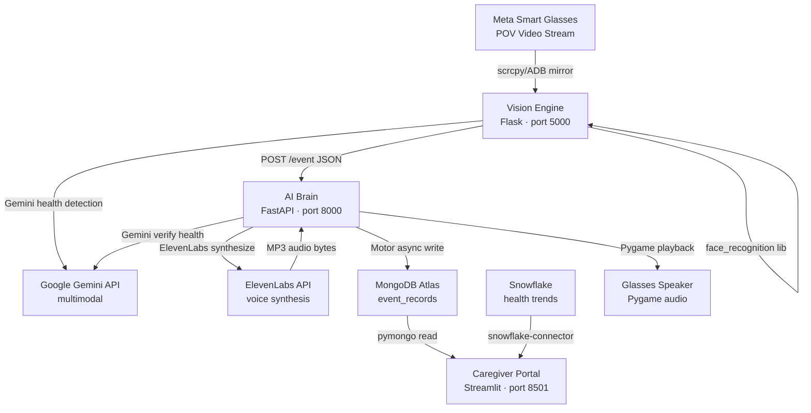

# Design Document: AuraGuard AI

## Overview

AuraGuard AI is a life-critical assistive platform for Alzheimer's patients. Three coordinated Python services run on a single laptop and communicate through a shared JSON Contract:

- **Vision Engine** (port 5000) — captures frames from Meta Smart Glasses, performs local face recognition, detects health items via Gemini, and POSTs structured Events to the Brain.
- **AI Brain** (port 8000) — the central coordinator; validates Events, verifies health observations via Gemini multimodal API, generates personalized voice scripts, synthesizes speech via ElevenLabs, plays audio through the glasses speaker, and logs enriched Event_Records to MongoDB Atlas.
- **Caregiver Portal** (port 8501) — a Streamlit dashboard that displays a real-time event feed from MongoDB Atlas and longitudinal health trends from Snowflake.

The system is designed for a hackathon demo context where correctness, low latency, and graceful degradation under API failure are first-class concerns. Every downstream failure (Gemini, ElevenLabs, MongoDB, Snowflake) is logged and processing continues — the system never crashes due to an external service being unavailable.

---

## Architecture

### System Topology



### Data Flow

1. The glasses stream a first-person POV video to the laptop via scrcpy/ADB.
2. The Vision Engine reads frames in a continuous loop.
3. For each frame, the Vision Engine runs face recognition locally and calls Gemini for health item detection in parallel.
4. When a detection fires, the Vision Engine constructs a JSON Event and POSTs it to `Brain POST /event`.
5. The Brain validates the Event, runs Gemini multimodal verification (health events only), generates a voice script, calls ElevenLabs, plays audio through the glasses speaker via Pygame, and writes an Event_Record to MongoDB Atlas — all synchronously before returning HTTP 200.
6. The Caregiver Portal polls MongoDB Atlas every 5 seconds for new Event_Records and Snowflake for health trend aggregates.

### Service Boundaries

Each service is independently launchable and fails gracefully when its dependencies are unavailable. The `run_all.py` launcher starts all three as subprocesses from a single terminal.

---

## Components and Interfaces

### Vision Engine (`services/vision/`)

| Component | Responsibility |
|---|---|
| `capture.py` | Opens the video source, runs the continuous frame capture loop |
| `face_recognition_pipeline.py` | Loads known face encodings at startup, detects and matches faces per frame |
| `health_detection_pipeline.py` | Sends frames to Gemini for food/water/medicine detection |
| `event_builder.py` | Constructs well-formed Event payloads from detection results |
| `dispatcher.py` | POSTs Events to the Brain with timeout and error handling |
| `main.py` | Flask app entry point; wires all components together |

### AI Brain (`services/brain/`)

| Component | Responsibility |
|---|---|
| `main.py` | FastAPI app entry point; lifespan startup/shutdown hooks |
| `config.py` | Pydantic-settings `Settings` model; validates all env vars at startup |
| `models.py` | Pydantic models for `Event`, `EventRecord`, and API response schemas |
| `routes/event.py` | `POST /event` handler; orchestrates the full processing pipeline |
| `routes/health.py` | `GET /health` handler; checks MongoDB connectivity |
| `services/gemini.py` | Gemini API client; verification and prompt construction |
| `services/elevenlabs.py` | ElevenLabs API client; voice synthesis and MP3 file management |
| `services/audio.py` | Pygame mixer; device selection, playback, fallback logic |
| `services/mongodb.py` | Motor async client; Event_Record writes |

### Caregiver Portal (`services/dashboard/`)

| Component | Responsibility |
|---|---|
| `app.py` | Streamlit app entry point; layout, auto-refresh loop |
| `data/mongodb_reader.py` | Queries MongoDB Atlas for recent Event_Records |
| `data/snowflake_reader.py` | Queries Snowflake for aggregated health trend data |
| `components/event_feed.py` | Renders the live event feed table with severity color coding |
| `components/health_charts.py` | Renders Plotly time-series health trend charts |

### Shared Contract (`shared/contract.py`)

A single Python module imported by all three services that defines the canonical Pydantic models for `Event` and `EventRecord`. This is the single source of truth for the JSON Contract.

---

## Data Models

### JSON Contract

#### Event (Vision Engine → Brain)

```python
class Event(BaseModel):
    event_id: str          # UUID v4 string
    timestamp: str         # ISO 8601 UTC string (e.g. "2024-05-01T12:00:00Z")
    patient_id: str        # Patient identifier (from PATIENT_ID env var)
    type: Literal["health", "identity"]
    subtype: str           # "face_recognized" | "eating" | "drinking" | "medicine_taken"
    confidence: float      # [0.0, 1.0]
    image_b64: str         # Base64-encoded JPEG frame
    metadata: dict         # See metadata schemas below
    source: Literal["vision_engine_v1"]
```

#### Event Metadata Schemas

```python
# For type="identity"
class IdentityMetadata(BaseModel):
    person_profile: PersonProfile

class PersonProfile(BaseModel):
    name: str
    relationship: str      # e.g. "son", "daughter", "doctor"
    background: str        # One-sentence biography
    last_conversation: str # Summary of last conversation with patient

# For type="health"
class HealthMetadata(BaseModel):
    detected_item: str     # "food" | "water" | "medicine"
```

#### EventRecord (Brain → MongoDB Atlas)

```python
class EventRecord(BaseModel):
    event_id: str
    timestamp: str
    patient_id: str
    type: str
    subtype: str
    confidence: float
    # NOTE: image_b64 is intentionally excluded
    metadata: dict
    source: str
    verified: bool
    voice_script: str
    processing_status: Literal["success", "partial_failure"]
    processed_at: str      # ISO 8601 UTC timestamp set by Brain
```

### Person_Profile Storage (Vision Engine)

Each entry in the `Known_Faces_Directory` consists of two files with matching base names:

```
known_faces/
  hussain.jpg          # Reference face image
  hussain.json         # Person_Profile JSON
  dr_ahmed.jpg
  dr_ahmed.json
```

Person_Profile JSON format:
```json
{
  "name": "Hussain",
  "relationship": "son",
  "background": "Software engineer living in Tampa.",
  "last_conversation": "He told you about his new job at a tech startup."
}
```

### API Response Schemas

```python
# POST /event — success
class EventResponse(BaseModel):
    event_id: str
    status: Literal["processed", "error"]
    message: str

# GET /health — healthy
class HealthResponse(BaseModel):
    status: Literal["ok", "degraded"]
    reason: Optional[str] = None  # present when status="degraded"
```

---

## Service-Level Design

### Vision Engine

#### Startup Sequence

1. Load environment variables (`PATIENT_ID`, `BRAIN_HOST`, `BRAIN_PORT`, `GEMINI_API_KEY`, `VIDEO_SOURCE`).
2. Load known face encodings from `Known_Faces_Directory`. Log a warning and disable face recognition if the directory is empty or missing.
3. Open the video source (OpenCV `VideoCapture`). Exit with non-zero status if the source cannot be opened.
4. Start the Flask app (used only for health checks; the main work is in the capture loop thread).

#### Frame Capture Loop

```
while True:
    ret, frame = cap.read()
    if not ret:
        log_warning("frame read failed, skipping")
        continue
    run_face_recognition(frame)
    run_health_detection(frame)   # async Gemini call
```

Face recognition and health detection run on each frame. To avoid flooding the Brain, a simple cooldown (e.g., 3 seconds per person, 5 seconds per health subtype) prevents duplicate events for the same detection.

#### Face Recognition Pipeline

```
1. face_recognition.face_locations(frame)  → list of bounding boxes
2. face_recognition.face_encodings(frame, locations)  → list of 128-d encodings
3. For each encoding:
   a. face_recognition.compare_faces(known_encodings, encoding)  → matches list
   b. face_recognition.face_distance(known_encodings, encoding)  → distances
   c. best_match_index = argmin(distances) where matches[index] is True
   d. If best_match_index found:
      - Load Person_Profile for that index
      - confidence = 1.0 - distances[best_match_index]
      - Build identity Event
      - POST to Brain
```

#### Health Detection Pipeline

```
1. Encode frame as base64 JPEG
2. Call Gemini with prompt:
   "Look at this image. Is the person eating food, drinking water or a beverage,
    or taking medicine? If yes, respond with one of: EATING, DRINKING, MEDICINE_TAKEN.
    If none of these, respond with NONE."
3. Parse response:
   - "EATING"        → subtype="eating",        detected_item="food"
   - "DRINKING"      → subtype="drinking",       detected_item="water"
   - "MEDICINE_TAKEN"→ subtype="medicine_taken", detected_item="medicine"
   - "NONE" or error → skip, no event
4. confidence = inferred from Gemini response certainty language (default 0.85 if not parseable)
5. Build health Event with image_b64 included
6. POST to Brain
```

### AI Brain

#### Startup Lifespan (FastAPI)

```python
@asynccontextmanager
async def lifespan(app: FastAPI):
    # Startup
    settings = get_settings()          # raises if required env vars missing
    motor_client = init_motor(settings.MONGODB_URI)
    await verify_mongodb(motor_client) # log warning on failure, don't exit
    init_pygame(settings.GLASSES_AUDIO_DEVICE)  # log warning on failure
    app.state.motor_client = motor_client
    app.state.settings = settings
    yield
    # Shutdown
    motor_client.close()
```

#### POST /event Processing Pipeline

```
1. Pydantic validation (automatic via FastAPI)
   → HTTP 422 on schema violation

2. Gemini verification (health events only, 10s timeout)
   → verified = parse_gemini_response(response)
   → on failure: verified = False, log error

3. Voice script generation
   → identity event: compose from person_profile fields
   → health + verified=True: compose from subtype + PATIENT_NAME
   → health + verified=False: voice_script = ""

4. ElevenLabs synthesis (if voice_script non-empty, 15s timeout)
   → save MP3 to audio/{event_id}.mp3
   → on failure: skip playback, log error

5. Pygame audio playback (if MP3 saved successfully)
   → select GLASSES_AUDIO_DEVICE or fall back to default
   → block until playback complete
   → delete MP3 after playback
   → on failure: log error, continue

6. MongoDB write (Motor async, 5s timeout)
   → write EventRecord (without image_b64)
   → on failure: processing_status = "partial_failure", log error

7. Return HTTP 200
   → {"event_id": ..., "status": "processed", "message": ...}
   → message reflects whether partial failures occurred
```

#### GET /health

```python
async def health_check():
    try:
        await motor_client.admin.command("ping")
        return {"status": "ok"}
    except Exception:
        return JSONResponse(status_code=503,
                            content={"status": "degraded",
                                     "reason": "mongodb_unreachable"})
```

### Caregiver Portal

#### Layout

```
┌─────────────────────────────────────────────────────┐
│  AuraGuard AI — Caregiver Portal                    │
│  Patient: Ismail  |  Last refresh: 12:34:56         │
├─────────────────────────────────────────────────────┤
│  LIVE EVENT FEED                                    │
│  ┌──────────┬────────┬──────────┬──────────────┐   │
│  │timestamp │ type   │ subtype  │ voice_script │   │
│  │ (yellow) │ health │ drinking │ "Good job…"  │   │
│  │ (green)  │identity│face_rec… │ "Ismail, …"  │   │
│  └──────────┴────────┴──────────┴──────────────┘   │
├─────────────────────────────────────────────────────┤
│  HEALTH TRENDS (Snowflake)                          │
│  [Plotly time-series chart: events per hour]        │
└─────────────────────────────────────────────────────┘
```

#### Auto-Refresh

Streamlit's `st.rerun()` with `time.sleep(5)` in a loop, or `st_autorefresh` component for 5-second polling. On each cycle:
1. Query MongoDB Atlas for latest 50 Event_Records ordered by `processed_at` desc.
2. Query Snowflake for health event counts grouped by hour over the last 24 hours.
3. Re-render both components.
4. On MongoDB failure: display cached data + warning banner.
5. On Snowflake failure: display placeholder chart + warning message.

---

## Key Algorithms

### Gemini Verification Response Parsing

```python
def parse_gemini_verified(response_text: str) -> bool:
    normalized = response_text.strip().upper()
    return normalized.startswith("YES") or "YES," in normalized or "YES." in normalized
```

This is intentionally conservative: any ambiguous response defaults to `False` to avoid false positive health alerts.

### Voice Script Templates

```python
IDENTITY_TEMPLATE = (
    "{patient_name}, {person_name} is here. "
    "{person_name} is your {relationship}. "
    "{background} "
    "Last time you spoke, {last_conversation}"
)

HEALTH_TEMPLATES = {
    "drinking":       "Good job, {patient_name}. I can see you are drinking water. Stay hydrated.",
    "eating":         "{patient_name}, I can see you are eating. Enjoy your meal.",
    "medicine_taken": "{patient_name}, I see you are taking your medication. Well done.",
}
```

### Event Cooldown (Vision Engine)

```python
class CooldownTracker:
    def __init__(self):
        self._last_fired: dict[str, float] = {}
        self._cooldowns = {
            "face_recognized": 3.0,
            "eating":          5.0,
            "drinking":        5.0,
            "medicine_taken":  10.0,
        }

    def should_fire(self, subtype: str, key: str) -> bool:
        cooldown = self._cooldowns.get(subtype, 5.0)
        last = self._last_fired.get(key, 0.0)
        if time.time() - last >= cooldown:
            self._last_fired[key] = time.time()
            return True
        return False
```

---

## Error Handling and Graceful Degradation

### Degradation Matrix

| Failure | Affected Service | Behavior |
|---|---|---|
| Brain unreachable | Vision Engine | Log error, continue capture loop |
| Gemini API failure | Brain | `verified=False`, skip voice for health events, continue to MongoDB |
| Gemini timeout (>10s) | Brain | Treat as failure above |
| ElevenLabs API failure | Brain | Log error, skip audio playback, continue to MongoDB |
| ElevenLabs timeout (>15s) | Brain | Treat as failure above |
| Glasses speaker not found | Brain | Fall back to default system audio, log warning |
| Pygame init/play failure | Brain | Log error, skip audio, continue to MongoDB |
| MongoDB write failure | Brain | Log error, return HTTP 200 with `processing_status="partial_failure"` |
| MongoDB timeout (>5s) | Brain | Treat as failure above |
| MongoDB unavailable | Caregiver Portal | Display cached data, show warning banner |
| Snowflake unavailable | Caregiver Portal | Show placeholder chart, continue event feed |
| Vision Engine frame drop | Vision Engine | Log warning, continue to next frame |
| Known_Faces_Directory empty | Vision Engine | Log warning, disable face recognition, continue |

### HTTP Status Code Contract

```python
@app.exception_handler(Exception)
async def global_exception_handler(request, exc):
    logger.exception("Unhandled exception")
    event_id = getattr(request.state, "event_id", "unknown")
    return JSONResponse(
        status_code=500,
        content={"event_id": event_id, "status": "error",
                 "message": "Internal server error."}
    )
```

### Timeout Implementation

```python
async def call_gemini_with_timeout(image_b64: str, prompt: str) -> str:
    try:
        return await asyncio.wait_for(
            _call_gemini(image_b64, prompt),
            timeout=10.0
        )
    except asyncio.TimeoutError:
        raise GeminiTimeoutError("Gemini call exceeded 10s timeout")
```

---

## Configuration Management

### Brain Settings

```python
class Settings(BaseSettings):
    GEMINI_API_KEY: str
    ELEVENLABS_API_KEY: str
    ELEVENLABS_VOICE_ID: str
    MONGODB_URI: str
    MONGODB_DB: str
    MONGODB_COLLECTION: str
    PATIENT_NAME: str
    PATIENT_ID: str
    GLASSES_AUDIO_DEVICE: str
    model_config = SettingsConfigDict(env_file=".env", env_file_encoding="utf-8")
```

### Vision Engine Settings

```python
class VisionSettings(BaseSettings):
    PATIENT_ID: str
    BRAIN_HOST: str = "localhost"
    BRAIN_PORT: int = 8000
    GEMINI_API_KEY: str
    VIDEO_SOURCE: int | str = 0
    KNOWN_FACES_DIR: str = "known_faces"
```

### Caregiver Portal Settings

```python
class DashboardSettings(BaseSettings):
    MONGODB_URI: str
    MONGODB_DB: str
    MONGODB_COLLECTION: str
    SNOWFLAKE_ACCOUNT: str
    SNOWFLAKE_USER: str
    SNOWFLAKE_PASSWORD: str
    SNOWFLAKE_DATABASE: str
    SNOWFLAKE_SCHEMA: str
    SNOWFLAKE_WAREHOUSE: str
```

### run_all.py

```python
import subprocess, signal, sys, time
from dotenv import load_dotenv

load_dotenv()

SERVICES = [
    ["uvicorn", "brain.main:app", "--host", "0.0.0.0", "--port", "8000"],
    ["python", "-m", "vision.main"],
    ["streamlit", "run", "dashboard/app.py", "--server.port", "8501"],
]

processes = [subprocess.Popen(cmd) for cmd in SERVICES]

def shutdown(sig, frame):
    for p in processes:
        p.terminate()
    for p in processes:
        p.wait()
    sys.exit(0)

signal.signal(signal.SIGINT, shutdown)

while True:
    for p in processes:
        if p.poll() is not None:
            print(f"Service {p.args[0]} exited with code {p.returncode}")
    time.sleep(1)
```

---

## Correctness Properties

Property-based testing is applicable to AuraGuard AI because the system contains significant pure logic: JSON schema validation, Gemini response parsing, voice script generation, Event_Record transformation, and API response contract enforcement. The `hypothesis` library (Python) is used for all property-based tests, configured to run a minimum of 100 iterations per property.

### Property 1: Valid Events Are Accepted, Invalid Events Are Rejected
*For any* Event payload, if it contains all required fields with correct types, the Brain SHALL return HTTP 200; if missing any required field or containing an invalid type, the Brain SHALL return HTTP 422. **Validates: Requirements 1.2, 1.4, 16.2**

### Property 2: HTTP 200 Response Always Contains Echoed event_id
*For any* valid Event payload, the Brain's HTTP 200 response SHALL contain an `event_id` identical to the submitted payload's `event_id`. **Validates: Requirements 1.5, 8.2**

### Property 3: Identity Events Always Set verified=true Without Calling Gemini
*For any* Event with `type="identity"`, the Brain SHALL set `verified=true` and SHALL NOT invoke the Gemini API. **Validates: Requirements 2.4**

### Property 4: Health Event Gemini Prompts Are Subtype-Specific
*For any* health Event with a given `subtype`, the Gemini prompt SHALL contain a targeted question specific to that subtype. **Validates: Requirements 2.2**

### Property 5: Gemini Response Parsing Is Deterministic
*For any* response string beginning with "YES" (case-insensitive), `parse_gemini_verified` SHALL return `True`; for any other string, it SHALL return `False`. **Validates: Requirements 2.3**

### Property 6: Unverified Health Events Produce Empty Voice Scripts and No Audio
*For any* health Event where `verified=False`, the Brain SHALL produce an empty `voice_script` and SHALL NOT call ElevenLabs or attempt audio playback. **Validates: Requirements 3.3, 4.1**

### Property 7: Identity Voice Scripts Contain All Person Profile Fields
*For any* identity Event with a `person_profile`, the generated `voice_script` SHALL contain `name`, `relationship`, `background`, and `last_conversation` as substrings. **Validates: Requirements 3.1**

### Property 8: Health Voice Scripts Contain Patient Name and Are Subtype-Appropriate
*For any* verified health Event, the `voice_script` SHALL contain `PATIENT_NAME` and SHALL reference the activity described by `subtype`. **Validates: Requirements 3.2**

### Property 9: Audio Files Are Named by event_id
*For any* Event triggering ElevenLabs synthesis, the MP3 file path SHALL be `audio/{event_id}.mp3`. **Validates: Requirements 4.3**

### Property 10: Event_Record Excludes image_b64 and Includes All Enrichment Fields
*For any* Event containing `image_b64`, the Event_Record written to MongoDB SHALL NOT contain `image_b64` and SHALL contain `verified`, `voice_script`, `processing_status`, and `processed_at`. **Validates: Requirements 6.2, 6.6, 16.5**

### Property 11: Downstream Failures Never Produce HTTP 5xx
*For any* combination of downstream failures, the Brain SHALL return HTTP 200 to the Vision Engine. **Validates: Requirements 8.3, 8.4, 20.2, 20.3, 20.4**

### Property 12: All Brain Responses Have Content-Type application/json
*For any* request to `POST /event` or `GET /health`, the response SHALL include `Content-Type: application/json`. **Validates: Requirements 8.1**

### Property 13: Vision Engine Events Conform to JSON Contract
*For any* detection result, the constructed Event SHALL contain all required JSON Contract fields with correct types. **Validates: Requirements 13.1, 16.1**

### Property 14: Round-Trip Event Compatibility
*For any* valid Event produced by the Vision Engine, the Brain's Pydantic `Event` model SHALL parse it without a `ValidationError`. **Validates: Requirements 16.6**

---

## Testing Strategy

| Property | Test Module | Key Generators |
|---|---|---|
| Property 1 | `tests/brain/test_event_validation.py` | `st.builds(Event, ...)`, random field removal |
| Property 2 | `tests/brain/test_event_response.py` | `st.builds(Event, ...)` with mocked downstream |
| Property 3 | `tests/brain/test_gemini_routing.py` | `st.builds(Event, type=st.just("identity"), ...)` |
| Property 4 | `tests/brain/test_gemini_prompts.py` | `st.sampled_from(["eating", "drinking", "medicine_taken"])` |
| Property 5 | `tests/brain/test_gemini_parsing.py` | `st.text()` with YES/NO prefix strategies |
| Property 6 | `tests/brain/test_voice_routing.py` | `st.builds(Event, type=st.just("health"), ...)` |
| Property 7 | `tests/brain/test_voice_scripts.py` | `st.builds(PersonProfile, ...)` |
| Property 8 | `tests/brain/test_voice_scripts.py` | `st.sampled_from(subtypes)`, `st.text()` for patient name |
| Property 9 | `tests/brain/test_audio.py` | `st.uuids()` for event_id |
| Property 10 | `tests/brain/test_event_record.py` | `st.builds(Event, ...)` |
| Property 11 | `tests/brain/test_degradation.py` | `st.builds(Event, ...)` with injected failures |
| Property 12 | `tests/brain/test_api_contract.py` | Various request types |
| Property 13 | `tests/vision/test_event_builder.py` | `st.builds(DetectionResult, ...)` |
| Property 14 | `tests/integration/test_contract.py` | `st.builds(Event, ...)` |
