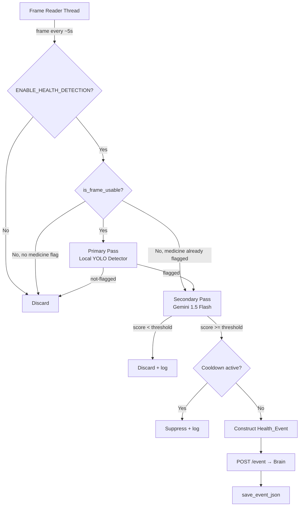
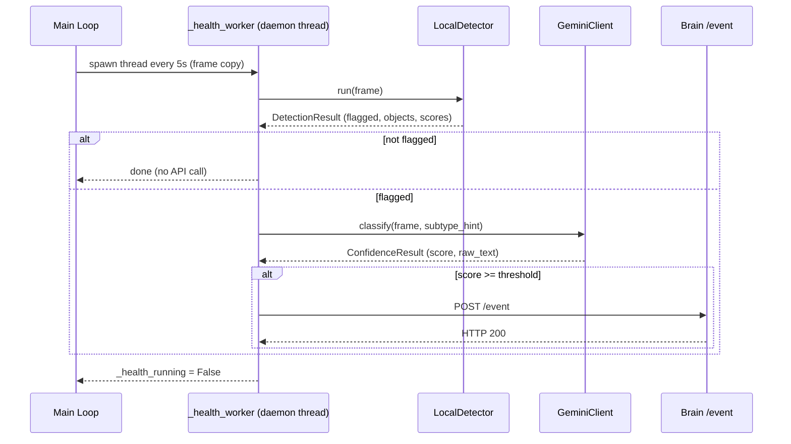

# Design Document: Hybrid Health Detection

## Overview

The hybrid health detection feature replaces the internals of `detect_health_activity()` in `services/vision/face_recognition_engine.py` with a two-pass pipeline. The existing function signature, caller interface, and all downstream contracts (Brain service, `shared/contract.py`) remain unchanged — this is a drop-in replacement.

**Current behaviour:** Every frame sampled at the 5-second health interval is sent directly to Gemini 1.5 Flash for classification. There is no local pre-filter, so every sample incurs a cloud API call regardless of whether anything health-relevant is visible.

**New behaviour:** A fast local YOLO-based detector (Primary Pass) runs first on each sampled frame. Only frames containing health-relevant objects are escalated to Gemini (Secondary Pass), which now returns a structured confidence score rather than a keyword. Per-subtype thresholds gate event dispatch, with a lower threshold for `medicine_taken` to bias toward safety.

The face recognition pipeline (YuNet + SFace, 2-second interval) is completely independent and is not modified.

---

## Architecture

### High-Level Data Flow



### Threading Model

The architecture inherits the existing threading model without changes:



The `_health_running` flag and `_lock` mutex already prevent concurrent health worker threads. The `LocalDetector` must be thread-safe (YOLO inference via Ultralytics is thread-safe when the model is loaded once and called with `model(frame)` — no shared mutable state per call).

---

## Components and Interfaces

### 1. `LocalDetector` (new module: `services/vision/local_detector.py`)

Encapsulates YOLO model loading and frame classification. Loaded once at module import time (or at first call if lazy loading is preferred for testability).

```python
from dataclasses import dataclass, field

@dataclass
class DetectionResult:
    flagged: bool
    detected_objects: list[str]          # raw YOLO class labels
    confidence_scores: dict[str, float]  # label -> score
    medicine_flagged: bool               # True if any medicine object detected

class LocalDetector:
    def __init__(self, model_path: str, confidence_threshold: float = 0.4): ...
    def run(self, frame_bgr: np.ndarray) -> DetectionResult: ...
```

**Key behaviours:**
- `run()` returns within 200 ms on CPU (YOLOv8n is ~50–80 ms on modern CPU).
- A frame is `flagged=True` if any detected object maps to a key in `HEALTH_SUBTYPE_MAP`.
- `medicine_flagged=True` if any detected object maps to the `medicine_taken` subtype, **regardless of YOLO confidence score** (safety override, Requirement 6.2).
- No network I/O. All inference is local.
- Thread-safe: Ultralytics `YOLO` model objects are safe to call from multiple threads when loaded once.

**Model loading:**
```python
# At module level in local_detector.py
_detector: LocalDetector | None = None

def get_detector() -> LocalDetector:
    global _detector
    if _detector is None:
        _detector = _load_detector()  # raises on failure
    return _detector
```

The `face_recognition_engine.py` module calls `get_detector()` once during its own module-level initialisation block (alongside the existing `_load_face_models()` call), so the model is warm before the main loop starts.

### 2. `GeminiHealthClient` (new class inside `detect_health_activity` replacement, or extracted to `services/vision/gemini_health.py`)

Handles the Secondary Pass: builds a subtype-specific prompt, calls Gemini 1.5 Flash, parses the confidence score.

```python
@dataclass
class ConfidenceResult:
    score: float          # parsed float in [0.0, 1.0]
    raw_text: str         # raw Gemini response for logging
    subtype: str          # the subtype that was queried

def build_health_prompt(subtype: str) -> str: ...
def parse_confidence_score(response_text: str) -> float: ...  # returns 0.0 on parse failure

async def call_gemini_health(
    frame_b64: str,
    subtype: str,
    api_key: str,
    timeout: float = 10.0,
) -> ConfidenceResult: ...
```

**Prompt templates** (one per subtype):
- `drinking`: `"Is the person in this image drinking water or a beverage? Return ONLY a confidence score between 0.0 and 1.0 (e.g. 0.85). No other text."`
- `eating`: `"Is the person in this image eating food? Return ONLY a confidence score between 0.0 and 1.0 (e.g. 0.85). No other text."`
- `medicine_taken`: `"Is the person in this image taking medication, pills, or medicine? Return ONLY a confidence score between 0.0 and 1.0 (e.g. 0.85). No other text."`

**Score parsing:** Extract the first float matching `\d+\.\d+` or `\d+` from the response. Clamp to [0.0, 1.0]. Return 0.0 and log WARNING if no match.

### 3. `detect_health_activity()` — Replacement Implementation

The existing function in `face_recognition_engine.py` is replaced in-place. Its signature stays identical: `def detect_health_activity(frame_bgr: np.ndarray) -> None`.

The new implementation:

```python
def detect_health_activity(frame_bgr: np.ndarray) -> None:
    # 1. Frame quality check (with medicine safety override)
    quality_ok = is_frame_usable(frame_bgr)

    # 2. Primary Pass
    try:
        result = get_detector().run(frame_bgr)
    except Exception as e:
        log.warning("Local detector failed: %s — falling back to Gemini", e)
        result = DetectionResult(flagged=True, detected_objects=[], 
                                  confidence_scores={}, medicine_flagged=False)

    # 3. Medicine safety override: bypass quality gate if medicine already flagged
    if not quality_ok and not result.medicine_flagged:
        log.debug("Frame quality check failed, skipping health detection")
        return

    if not result.flagged:
        log.debug("Primary pass: not flagged. Objects: %s", result.detected_objects)
        return

    # 4. Determine subtype from detected objects
    subtype = _resolve_subtype(result.detected_objects)
    if subtype is None:
        return

    # 5. Secondary Pass
    threshold = _get_threshold(subtype)
    confidence_result = _run_secondary_pass(frame_bgr, subtype)
    if confidence_result is None:
        return

    # 6. Threshold gate
    if confidence_result.score < threshold:
        log.info("Health event suppressed: %s score=%.2f < threshold=%.2f",
                 subtype, confidence_result.score, threshold)
        return

    # 7. Cooldown gate
    now_ts = datetime.now(timezone.utc).timestamp()
    if now_ts - _last_health_event.get(subtype, 0) < HEALTH_COOLDOWN_SECONDS:
        remaining = HEALTH_COOLDOWN_SECONDS - (now_ts - _last_health_event[subtype])
        log.debug("Health event %s suppressed (cooldown, %.0fs remaining)", subtype, remaining)
        return
    _last_health_event[subtype] = now_ts

    # 8. Construct and dispatch event
    _dispatch_health_event(frame_bgr, subtype, confidence_result, result)
```

### 4. Per-Subtype Threshold Configuration

```python
# Default thresholds (overridable via env vars)
_DEFAULT_THRESHOLDS = {
    "medicine_taken": 0.45,
    "eating": 0.6,
    "drinking": 0.6,
}

def _get_threshold(subtype: str) -> float:
    env_val = os.getenv("HEALTH_DETECTION_THRESHOLD")
    if env_val:
        try:
            base = float(env_val)
        except ValueError:
            log.warning("Unparseable HEALTH_DETECTION_THRESHOLD, using defaults")
            base = None
    else:
        base = None
    
    if base is not None:
        # env var overrides all subtypes equally
        return base
    return _DEFAULT_THRESHOLDS.get(subtype, 0.6)
```

Note: `HEALTH_DETECTION_THRESHOLD` overrides all subtypes uniformly when set. The per-subtype defaults apply when the env var is absent.

---

## Data Models

### `DetectionResult`

| Field | Type | Description |
|---|---|---|
| `flagged` | `bool` | True if frame should be escalated to Secondary Pass |
| `detected_objects` | `list[str]` | Raw YOLO class labels above confidence threshold |
| `confidence_scores` | `dict[str, float]` | Per-label YOLO confidence scores |
| `medicine_flagged` | `bool` | True if any medicine-related object detected (ignores confidence threshold) |

### `ConfidenceResult`

| Field | Type | Description |
|---|---|---|
| `score` | `float` | Parsed confidence in [0.0, 1.0] |
| `raw_text` | `str` | Raw Gemini response text |
| `subtype` | `str` | The subtype queried (`drinking`, `eating`, `medicine_taken`) |

### `Health_Event` (unchanged — `shared/contract.py` `Event` model)

| Field | Value |
|---|---|
| `event_id` | UUID4 string |
| `timestamp` | UTC ISO-8601 |
| `patient_id` | `os.getenv("PATIENT_ID", "unknown")` |
| `type` | `"health"` |
| `subtype` | `"drinking"` \| `"eating"` \| `"medicine_taken"` |
| `confidence` | Confidence_Score from Secondary Pass |
| `image_b64` | JPEG-encoded frame, max 640px longest side |
| `metadata` | `{"detected_item": "<raw YOLO label>"}` |
| `source` | `"vision_engine_v1"` |

### Environment Variables

| Variable | Type | Default | Description |
|---|---|---|---|
| `ENABLE_HEALTH_DETECTION` | bool string | `"false"` | Master feature flag |
| `LOCAL_DETECTOR_MODEL` | path string | `tests/vision/models/yolov8n.pt` | Path to YOLO weights |
| `HEALTH_DETECTION_THRESHOLD` | float string | (per-subtype defaults) | Override all subtype thresholds |
| `LOCAL_DETECTOR_CONFIDENCE` | float string | `0.4` | YOLO object detection confidence floor |

---

## Correctness Properties

*A property is a characteristic or behavior that should hold true across all valid executions of a system — essentially, a formal statement about what the system should do. Properties serve as the bridge between human-readable specifications and machine-verifiable correctness guarantees.*

### Property 1: Gemini is never called for non-flagged frames

*For any* frame where the Local Detector returns `flagged=False`, the Gemini client SHALL NOT be invoked (zero calls to the Gemini API for that frame).

**Validates: Requirements 1.3**

---

### Property 2: Gemini is always called for flagged frames (when quality passes)

*For any* frame where the Local Detector returns `flagged=True` and the frame passes the quality check (or the medicine safety override applies), the Gemini client SHALL be invoked exactly once.

**Validates: Requirements 1.4, 6.3**

---

### Property 3: Health object detection implies flagging

*For any* frame where the Local Detector detects at least one object whose label maps to a key in `HEALTH_SUBTYPE_MAP`, the `DetectionResult.flagged` field SHALL be `True`.

**Validates: Requirements 1.5**

---

### Property 4: Confidence score parsing always yields a value in [0.0, 1.0]

*For any* string returned by Gemini (including strings with no numeric content, strings with multiple numbers, and strings with numbers outside [0, 1]), the `parse_confidence_score` function SHALL return a float in the closed interval [0.0, 1.0].

**Validates: Requirements 2.3, 2.4**

---

### Property 5: Below-threshold scores never produce events

*For any* subtype and *any* confidence score strictly below the configured threshold for that subtype, the pipeline SHALL construct no `Health_Event` and make no POST to the Brain.

**Validates: Requirements 2.5**

---

### Property 6: At-or-above-threshold scores produce exactly one event (when cooldown is inactive)

*For any* subtype and *any* confidence score at or above the configured threshold for that subtype, when the cooldown for that subtype is not active, the pipeline SHALL construct exactly one `Health_Event` and POST it to the Brain.

**Validates: Requirements 2.6, 3.1**

---

### Property 7: Dispatched events always contain all required fields with correct values

*For any* valid detection result that passes threshold and cooldown gates, the constructed `Health_Event` SHALL be a valid instance of `shared.contract.Event` with `type="health"`, `source="vision_engine_v1"`, a UUID4 `event_id`, a UTC ISO-8601 `timestamp`, and `confidence` equal to the Secondary Pass score.

**Validates: Requirements 3.1, 7.1, 7.2**

---

### Property 8: Cooldown suppresses all same-subtype events within 120 seconds

*For any* subtype, after one `Health_Event` of that subtype is dispatched, *any* subsequent detection of the same subtype within 120 seconds SHALL produce no additional `Health_Event` dispatch to the Brain.

**Validates: Requirements 3.4**

---

### Property 9: Quality-failed frames are skipped unless medicine is flagged

*For any* frame that fails `is_frame_usable()`, if the Local Detector has NOT flagged a medicine-related object, then neither the Local Detector escalation nor the Gemini call SHALL occur.

**Validates: Requirements 3.5, 6.3**

---

### Property 10: Medicine safety override bypasses quality gate

*For any* frame that fails `is_frame_usable()`, if the Local Detector HAS flagged a medicine-related object (`medicine_flagged=True`), the Secondary Pass SHALL still be invoked.

**Validates: Requirements 6.3**

---

### Property 11: Medicine objects are flagged at any YOLO confidence

*For any* YOLO detection result containing a medicine-related object label (pill, tablet, medicine, medication, medicine packet) at *any* confidence score (including 0.0), `DetectionResult.medicine_flagged` SHALL be `True` and `DetectionResult.flagged` SHALL be `True`.

**Validates: Requirements 6.2**

---

### Property 12: Medicine threshold is always lower than other subtype thresholds

*For any* valid configuration (including when `HEALTH_DETECTION_THRESHOLD` env var is unset), the effective threshold for `medicine_taken` SHALL be strictly less than the effective threshold for `eating` and strictly less than the effective threshold for `drinking`.

**Validates: Requirements 6.1**

---

### Property 13: HEALTH_SUBTYPE_MAP round-trip

*For any* key in `HEALTH_SUBTYPE_MAP`, the mapped value SHALL be one of `{"drinking", "eating", "medicine_taken"}`, and the mapping SHALL be deterministic (same key always produces same subtype).

**Validates: Requirements 7.4**

---

### Property 14: Model is loaded exactly once regardless of frame count

*For any* number N ≥ 1 of frames processed by the health detection pipeline, the YOLO model loading function SHALL be called exactly once (at startup), not once per frame.

**Validates: Requirements 8.1, 8.3**

---

### Property 15: Subtype-specific prompts reference the correct subtype

*For any* subtype in `{"drinking", "eating", "medicine_taken"}`, the prompt generated by `build_health_prompt(subtype)` SHALL contain a keyword specific to that subtype and SHALL NOT contain keywords specific to other subtypes.

**Validates: Requirements 2.1, 2.2**

---

## Error Handling

### Local Detector Failure (Requirement 1.7)

If `LocalDetector.run()` raises any exception:
1. Log at `WARNING` level with the exception message.
2. Construct a synthetic `DetectionResult(flagged=True, detected_objects=[], confidence_scores={}, medicine_flagged=False)`.
3. Proceed to the Secondary Pass with the original frame.
4. This preserves the existing behaviour (Gemini always called) as a safe fallback.

### Local Detector Model Load Failure (Requirement 8.2)

If the YOLO model fails to load at startup (file not found, corrupt weights, etc.):
1. Log at `CRITICAL` level.
2. Set a module-level `_health_detection_disabled = True` flag.
3. `detect_health_activity()` checks this flag and returns immediately.
4. Face recognition continues normally — the main loop is unaffected.

### Gemini Timeout (Requirement 2.7)

The Secondary Pass call is wrapped in `asyncio.wait_for(..., timeout=10.0)` (or `threading.Timer` in the synchronous context). On timeout:
1. Log at `ERROR` level: `"Secondary pass timed out after 10s for subtype={subtype}"`.
2. Return `None` from `_run_secondary_pass()`.
3. No event is dispatched.

### Gemini Parse Failure (Requirement 2.4)

If `parse_confidence_score()` finds no numeric value in the response:
1. Log at `WARNING` level with the raw response text.
2. Return `0.0`.
3. The `0.0` score will be below any threshold, so no event is dispatched.

### Brain POST Failure (Requirement 3.3)

If the Brain POST returns non-2xx or raises a connection error:
1. Log at `ERROR` level with the status code or exception.
2. Do not retry.
3. The cooldown timestamp has already been set, so the event is not re-attempted within the cooldown window.

### Configuration Errors (Requirement 4.3, 4.5)

- Unparseable `HEALTH_DETECTION_THRESHOLD`: log `WARNING`, use per-subtype defaults.
- `LOCAL_DETECTOR_MODEL` points to nonexistent file: log `CRITICAL`, disable health detection for session.

---

## Testing Strategy

### Dual Testing Approach

Both unit tests and property-based tests are used. Unit tests cover specific examples, integration points, and error conditions. Property-based tests verify universal invariants across a wide input space.

### Property-Based Testing Library

**[Hypothesis](https://hypothesis.readthedocs.io/)** (Python) is the chosen PBT library. It integrates naturally with pytest, supports structured data generation via `@given` and `st.*` strategies, and runs a minimum of 100 iterations per property by default.

Each property test is tagged with a comment referencing the design property:
```python
# Feature: hybrid-health-detection, Property N: <property_text>
```

### Property Tests

Each of the 15 correctness properties maps to one Hypothesis test. Key strategies:

- **Frames**: `st.binary()` decoded as JPEG, or `numpy` arrays generated via `hypothesis-numpy` / `st.builds(np.zeros, ...)`.
- **Confidence scores**: `st.floats(min_value=0.0, max_value=1.0)` and `st.floats()` (unbounded, for clamping tests).
- **Response strings**: `st.text()` for parse failure tests; `st.floats(0.0, 1.0).map(str)` for valid responses.
- **Subtypes**: `st.sampled_from(["drinking", "eating", "medicine_taken"])`.
- **Object labels**: `st.sampled_from(list(HEALTH_SUBTYPE_MAP.keys()))`.
- **N frames**: `st.integers(min_value=1, max_value=50)`.

Minimum 100 iterations per test (Hypothesis default `max_examples=100`; increase to 200 for safety-critical properties 10–12).

### Unit Tests

Unit tests cover:
- Configuration parsing: all four env vars, valid/invalid/missing values.
- Startup failure paths: model not found, CRITICAL log, health detection disabled.
- Error handling: detector exception → fallback, Gemini timeout, Brain POST failure.
- Logging assertions: DEBUG/INFO/ERROR/WARNING messages at each pipeline step.
- Cooldown edge cases: exactly at 120s boundary, just before, just after.
- Thread safety: concurrent calls to `LocalDetector.run()` from multiple threads.

### Integration Tests

- End-to-end: real YOLO model + mocked Gemini + mocked Brain. Verify a frame containing a cup triggers a `drinking` event.
- Backward compatibility: verify `shared.contract.Event` is accepted by the Brain route handler without modification.

### Test File Layout

```
tests/
  vision/
    models/
      yolov8n.pt          # downloaded once, gitignored
    test_local_detector.py
    test_gemini_health.py
    test_detect_health_activity.py
    test_health_properties.py   # all Hypothesis property tests
```
